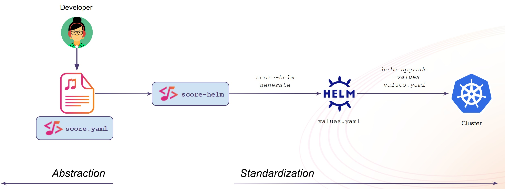

# score-helm

---

:warning: Deprecation Notice :warning:

We have deprecated the `score-helm` CLI implementation. To get started with Score, we recommend using one of our reference implementations [`score-compose`](https://github.com/score-spec/score-compose) or [`score-k8s`](https://github.com/score-spec/score-k8s). If you're interested in developing a `score-helm` reference implementation, we'd love to support you! Please reach out to us for assistance and collaboration.

---

`score-helm` is a Score implementation of the [Score specification](https://score.dev/) for [Helm](https://helm.sh/).

This will generate the `values.yaml` for your existing Helm chart based on the Score file.



- [CLI](./docs/cli.md)

```bash
score-helm init

score-helm generate score.yaml -o values.yaml

helm upgrade --install --values values.yaml ...
```